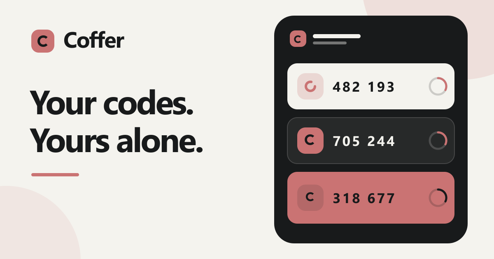

 [](https://github.com/caglaryalcin/Coffer/releases)

# Coffer

Coffer is a self-hosted, multi-user authenticator vault. It generates TOTP
codes in the browser and encrypts each user's vault before storing it on the
server. It also supports QR imports, groups, backups, and 2FAS transfers.


## Features

- Multi-user, browser-encrypted vaults
- TOTP generation with QR and manual account setup
- Groups, favorites, archive, search, and bulk actions
- Automatic local service logos and custom logo uploads
- Encrypted backups plus 2FAS, 2FAuth, and OTPAuth transfers
- Responsive light and dark interfaces

## Docker Compose

```bash
docker compose up --build -d
```

Open [http://localhost:3000](http://localhost:3000). Encrypted vault data is
stored in `./data` and remains there after `docker compose down`.

## Docker

```bash
docker build -t coffer .
docker volume create coffer-data
docker run -d --name coffer --init --restart unless-stopped -p 127.0.0.1:3000:3000 -v coffer-data:/app/data coffer
```

Open [http://localhost:3000](http://localhost:3000). The `coffer-data` volume
keeps encrypted vault data across container restarts and replacements.

## Environment variables

| Variable | Default | Purpose |
| --- | --- | --- |
| `COFFER_DATA_DIR` | `data` (`/app/data` in Docker) | Directory containing encrypted vault files. Mount persistent storage here. |
| `COFFER_TRUST_PROXY` | `0` | Set to `1` only behind a trusted reverse proxy so Coffer accepts forwarded origin, protocol, and client IP headers. |
| `VINEXT_TRUSTED_HOSTS` | Empty | Comma-separated public `host[:port]` allowlist, such as `coffer.example.com`. Recommended for HTTPS reverse-proxy deployments. |
| `HOST` | `0.0.0.0` in Docker | Address the application server listens on. |
| `PORT` | `3000` | Application server port inside the container. |
| `NODE_ENV` | `production` in Docker | Node.js runtime mode. |
| `APP_HOST` | `127.0.0.1` | Docker Compose host address used for the published port. |
| `APP_PORT` | `3000` | Docker Compose host port. |

The `COFFER_*`, `VINEXT_TRUSTED_HOSTS`, `HOST`, `PORT`, and `NODE_ENV` entries
are container environment variables. `APP_HOST` and `APP_PORT` are Docker
Compose substitutions. When using Compose, add `VINEXT_TRUSTED_HOSTS` to
`services.app.environment`; placing it only in `.env` does not pass it into
the container.

For HTTPS behind a reverse proxy, set both `COFFER_TRUST_PROXY=1` and
`VINEXT_TRUSTED_HOSTS` to the public hostname. The proxy must overwrite and
forward `X-Forwarded-Proto` and `X-Forwarded-Host`; the application backend
should not be exposed directly when proxy trust is enabled. Production browser
access requires HTTPS because vault encryption uses Web Crypto; `localhost` is
the development exception.

> Passwords cannot be recovered. Keep a backup of your encrypted vault data.
