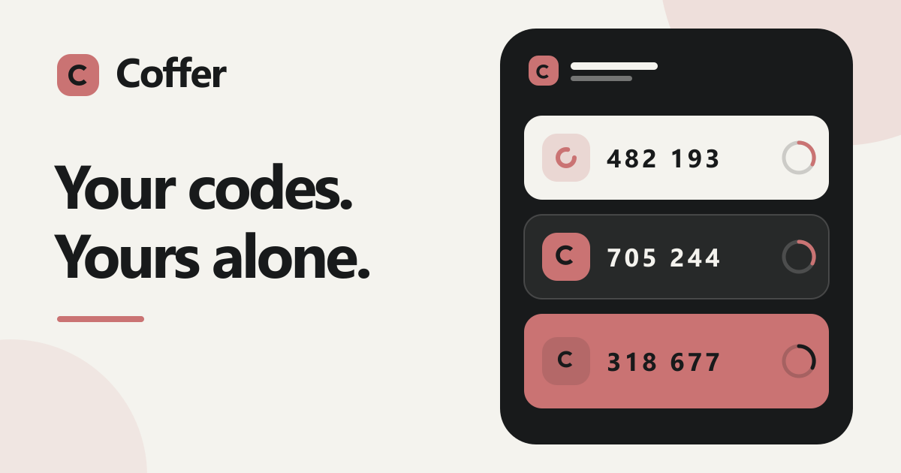

 [](https://github.com/caglaryalcin/Coffer/releases)

🌐 [Chrome Extension](https://chromewebstore.google.com/detail/coffer/ajekhlpjkcohkdedhkdjkadilecboimd)

🌐 [Firefox Extension](https://addons.mozilla.org/tr/firefox/addon/coffer/)

# Coffer

Coffer is a self-hosted, multi-user authenticator vault. It generates TOTP
codes in the browser and encrypts each user's vault before storing it on the
server. It also supports QR imports, groups, backups, and 2FAS transfers.


## Features

- Multi-user, browser-encrypted vaults
- TOTP generation with QR and manual account setup


- Groups, favorites, archive, search, and bulk actions
- Automatic local service logos and custom logo uploads


- Encrypted backups plus 2fas, 2fAuth, and OTPAuth transfers


  
- Responsive light and dark interfaces


## Docker
- Docker Hub: `caglaryalcin/coffer`
- GitHub Container Registry: `ghcr.io/caglaryalcin/coffer`

```bash
docker volume create coffer-data
docker run -d --name coffer --init --restart unless-stopped -p 3000:3000 -v coffer-data:/app/data caglaryalcin/coffer
```

To use GitHub Container Registry, replace the image with
`ghcr.io/caglaryalcin/coffer`.

Open [http://localhost:3000](http://localhost:3000). The `coffer-data` volume
keeps encrypted vault data across container restarts and replacements.

## Environment variables

| Variable | Default | Purpose |
| --- | --- | --- |
| `COFFER_DATA_DIR` | `data` (`/app/data` in Docker) | Directory containing encrypted vault files. Mount persistent storage here. |
| `COFFER_TRUST_PROXY` | `0` | Set to `1` only behind a trusted reverse proxy so Coffer accepts forwarded origin, protocol, and client IP headers. |
| `VINEXT_TRUSTED_HOSTS` | Empty | Comma-separated public `host[:port]` allowlist, such as `coffer.example.com`. Recommended for HTTPS reverse-proxy deployments. |
| `COFFER_OIDC_ISSUER_URL` | Empty | OIDC issuer URL. Setting this enables OIDC sign-in. |
| `COFFER_OIDC_CLIENT_ID` | Empty | OIDC client ID registered for Coffer. |
| `COFFER_OIDC_CLIENT_SECRET` | Empty | OIDC client secret. May be omitted for a public client that accepts PKCE. |
| `COFFER_OIDC_CLIENT_AUTH_METHOD` | `client_secret_basic` with a secret; otherwise `none` | Token endpoint authentication: `client_secret_basic`, `client_secret_post`, or `none`. |
| `COFFER_OIDC_PROVIDER_NAME` | `OpenID Connect` | Provider name shown on the sign-in button. |
| `COFFER_OIDC_SCOPES` | `openid email profile` | Space-separated OIDC scopes. `openid` and `email` are always requested. |
| `COFFER_OIDC_REDIRECT_URI` | Derived from request | Explicit callback URL, for example `https://coffer.example.com/api/auth/oidc/callback`. |
| `HOST` | `0.0.0.0` in Docker | Address the application server listens on. |
| `PORT` | `3000` | Application server port inside the container. |
| `NODE_ENV` | `production` in Docker | Node.js runtime mode. |
| `APP_HOST` | `127.0.0.1` | Docker Compose host address used for the published port. |
| `APP_PORT` | `3000` | Docker Compose host port. |

All `COFFER_*` settings, `VINEXT_TRUSTED_HOSTS`, `HOST`, `PORT`, and `NODE_ENV`
are container environment variables. `APP_HOST` and `APP_PORT` are Docker
Compose substitutions. When using Compose, add `VINEXT_TRUSTED_HOSTS` to
`services.app.environment`; placing it only in `.env` does not pass it into the
container.

### OpenID Connect

Register Coffer as an OIDC web application using the Authorization Code flow.
Add this callback URL to the provider:


```text
https://coffer.example.com/api/auth/oidc/callback
```

Then configure at least `COFFER_OIDC_ISSUER_URL` and `COFFER_OIDC_CLIENT_ID`.
Most confidential clients also require `COFFER_OIDC_CLIENT_SECRET`; use
`COFFER_OIDC_CLIENT_AUTH_METHOD` if the provider requires `client_secret_post`.
The provider must return an `email` claim, either in the ID token or from
UserInfo. Identities explicitly marked with `email_verified: false` are
rejected.
For reverse-proxy deployments, set `COFFER_OIDC_REDIRECT_URI` explicitly or
enable `COFFER_TRUST_PROXY=1` and ensure the proxy overwrites the forwarded host
and protocol headers.

After signing in to a vault, the same values can be managed from **Settings →
OpenID Connect**. Settings saved in the UI take precedence over environment
variables and are written atomically to
`COFFER_DATA_DIR/oidc-settings.json` (`/app/data/oidc-settings.json` in the
container). The data directory is restricted to mode `0700` and the settings
file to `0600` where the platform supports POSIX permissions. The client secret
is never returned by the settings API or rendered back into the browser. Keep
the mounted data volume private, encrypted at the Kubernetes storage layer when
available, and included in protected backups.

OIDC authenticates the account identity; the vault password still encrypts and
decrypts data only in the browser. Existing accounts are matched by their
normalized email address, so users can adopt OIDC without migrating vault data.
Browser extensions continue to use the existing email-and-vault-password flow.
OIDC authorization flows and sessions currently live in process memory. Run one
replica, or configure load-balancer affinity; pod restarts require users to sign
in to the identity provider again.

For HTTPS behind a reverse proxy, set both `COFFER_TRUST_PROXY=1` and
`VINEXT_TRUSTED_HOSTS` to the public hostname. The proxy must overwrite and
forward `X-Forwarded-Proto` and `X-Forwarded-Host`; the application backend
should not be exposed directly when proxy trust is enabled. Production browser
access requires HTTPS because vault encryption uses Web Crypto; `localhost` is
the development exception.

> Passwords cannot be recovered. Keep a backup of your encrypted vault data.